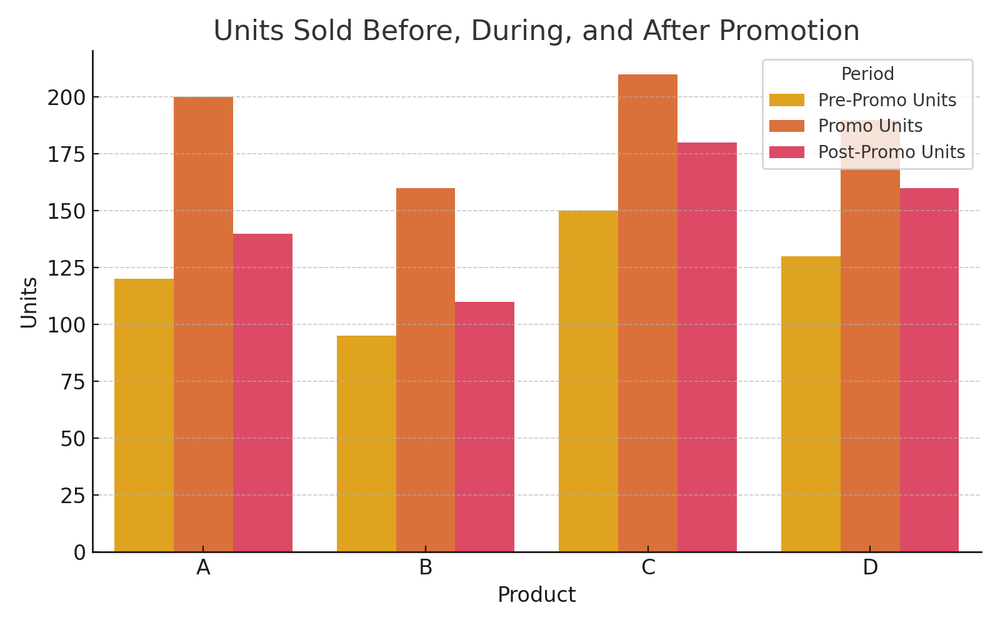
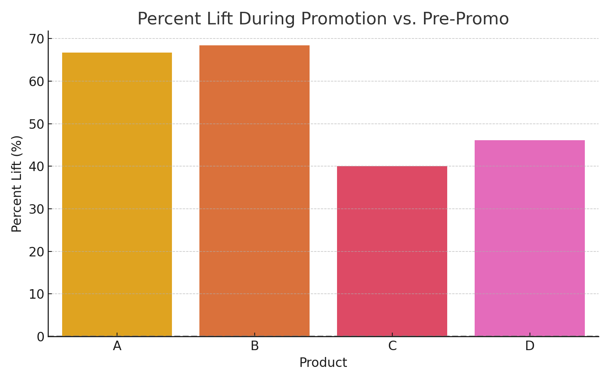
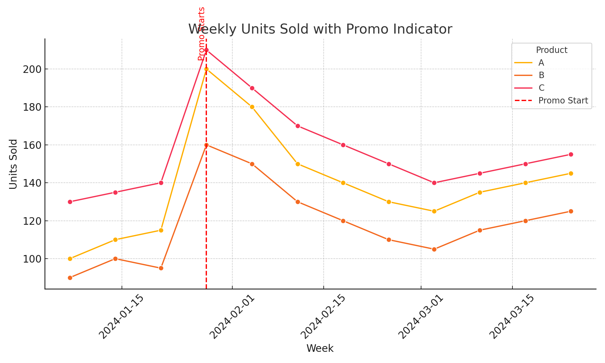

# Repeatable Product-Level Promo Analysis (PxP)

This project provides a **repeatable, widget-driven framework** for analyzing promotional impact at the product level (PxP). It uses PySpark to filter transactional data by product ID and date, enabling flexible deep dives into demand patterns, promotional lift, and customer behavior by SKU.

> 🔧 This template assumes you will **replace database, table names, and column schemas** with those from your environment. It is not tied to any particular company or dataset.

## 🔍 Features

- Accepts dynamic product lists and date ranges via widgets
- Filters and aggregates sales/demand across time windows
- Compares performance before, during, and after promotion periods
- Designed for use with Spark environments (Databricks, EMR, etc.)

## 📁 Structure

- `notebooks/`: Main interactive notebook
- `src/`: Optional utility modules
- `docs/`: For visual outputs or extended usage notes

## ▶️ Getting Started

1. Clone the repository:
   ```bash
   git clone https://github.com/<your-username>/repeatable-pxp-analysis.git
   ```

2. Open `notebooks/repeatable_pxp_analysis.ipynb` in your Spark-based notebook environment.

3. Update the following placeholders with your environment details:
   - Table names (e.g., `sales_transactions`, `product_reference`)
   - Column names (e.g., `customer_id`, `product_id`, `order_date`, `units_sold`)
   - Schema-specific logic (e.g., joins, filters, date parsing)

4. Use the widgets to:
   - Select start and end dates
   - Pass a list of product IDs

5. Run the notebook to generate visual summaries and performance comparisons.

## 📈 Example Use Cases

- Evaluate the success of SKU-level promotions
- Compare product demand before and after a campaign
- Generate repeatable analysis views for business stakeholders

## 📊 Example Visuals

### Units Sold Comparison


### Percent Lift from Promotion



### Weekly Units Sold with Promotion Highlight

This chart visualizes demand trends before, during, and after a promotion. The red dashed line indicates when the promotion started.



---

## 🧱 Requirements

- Python 3.x
- PySpark
- matplotlib
- seaborn
- pandas
- Compatible with Databricks or Jupyter with SparkSession

---

## 📩 Contact

## ✍️ Author
Made with ❤️ by James Witcher
[GitHub: jwitcher3](https://github.com/jwitcher3)  
[LinkedIn](https://www.https://www.linkedin.com/in/james-witcher/)

Built to enable analysts to move quickly from SKU list to insights. Contributions and feedback welcome!


